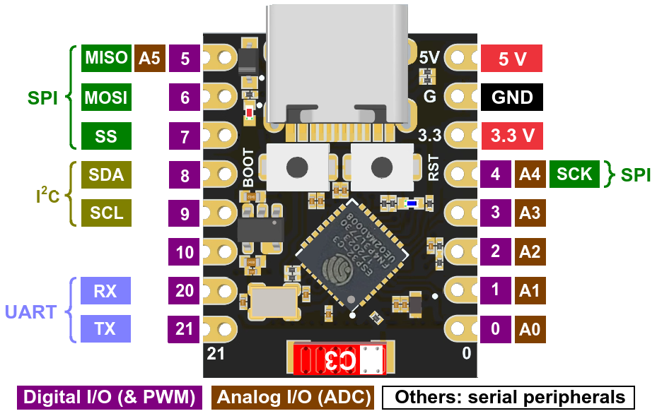
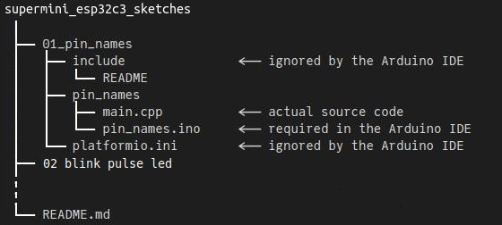

# Super Mini ESP32C3 Arduino Sketches / PlatformIO Projects

**Source code that accompanies [First Look at the Super Mini ESP32-C3](https://sigmdel.ca/michel/ha/esp8266/super_mini_esp32c3_en.html).**

---

**Code source qui accompagne [Coup d'oeil sur la carte de développement Super Mini ESP32-C3](https://sigmdel.ca/michel/ha/esp8266/super_mini_esp32c3_en.html).**

---



---

**Table of Content**

<!-- TOC -->

- [1. Introduction](#1-introduction)
- [2. Arduino IDE Notes](#2-arduino-ide-notes)
- [3. PlatformIO Notes](#3-platformio-notes)
- [4. List of Projects](#4-list-of-projects)

  **Hello world! sketches:**
  - [01_pin_names](#01_pin_names)
  - [02_blink_pulse_led](#02_blink_pulse_led)

  **Wi-Fi connectivity sketches:**
  - [03_scan_wifi](#03_scan_wifi)
  - [04_wifi_connect](#04_wifi_connect)
  - [05_wifi_tx_power](#05_wifi_tx_power)
  
  **Bluetooth connectivity sketches**
  - [07_ble_led](#07_ble_led)
  - [08_ble_led2](#08_ble_led2)

  **Working example:**
  - [06_async_web_led](#06_async_web_led)

  [5. Licence](#5-licence)

<!-- /TOC -->

## 1. Introduction

The Super Mini ESP32C3 boards are small simplified versions of the original Espressif development boards for the ESP32-C3 microcontroller. Unlike older Espressif microcontrollers, the C3 has a RISC-V core. 

It seems that there is more than one manufacturer of these boards that differ in more or less subtle ways. The pin diagram above shows the markings on four boards purchased from a Chinese vendor in late April 2024. There are no labels identifying the red power LED to the left of the USB connector and the blue LED under the reset (RST) button. There are no other components near the single component between the ESP32-C3 chip and the red ceramic antenna labelled C3. Other boards and the [schematic](https://wiki.icbbuy.com/doku.php?id=developmentboard:esp32-c3mini#schematic) have other components which may explain the problems encountered with Wi-Fi connectivity. 

It should be possible to compile these projects in the Arduino IDE or in PlatformIO, although there are difficulties in a couple of cases if using the Arduino IDE.

## 2. Arduino IDE Notes

Arduino sketches must have an `.ino` file name extension and must be contained in a directory that has the same name as the Arduino sketch (excluding the extension). Consequently the `01_pin_names` project contains a directory named `pin_names` that in turn contains the Arduino sketch `pin_names.ino`. That file is only a long comment. This is not a problem because the Arduino IDE will import all source files found in the sketch directory. The actual code is in `main.cpp` which is the default name of a PlatformIO project.

 

To compile and then upload the sketch in the Arduino IDE, click on the **File** top menu, click on **Open...**, then navigate to the `pin_names.ino` file and open it with the system file manager.

Following the instructions in [Installing using Arduino IDE](https://docs.espressif.com/projects/arduino-esp32/en/latest/installing.html#installing-using-arduino-ide) the latest release of the Arduino-ESP32 framework was installed by entering the following URL 
```
https://espressif.github.io/arduino-esp32/package_esp32_index.json
```
into the `Additional Board Manager URLs` field of the Arduino Preferences. Using the board manager install the Espressif Arduino core `esp32 version 3.0.1` or newer. It should then be possible to select `MakerGO ESP32 C3 SuperMini` as the board.

## 3. PlatformIO Notes

Because of the Arduino sketch naming constraints, the `main.cpp` file of a project is not stored in the default `src` directory. A `src_dir` entry in the `platformio.ini` configuration file provides the name of the directory in which `main.cpp` is found. That will be the name of the Arduino sketch as shown below for the `01_pin_names` project. 

```ini
[platformio]
; Make the Arduino IDE happysupermini_esp32c3_sketches (github)%  (.INO file must be in a directory of the same name)
src_dir = pin_names
```

PlatformIO will "convert" the sketch `.ino` file, but that is of no consequence since it contains only comments.

## 4. List of Projects      

The projects can be grouped in three categories. 

**Hello world! sketches:**
---

### 01_pin_names
  Lists the I/O pin names and numbers of the Super Mini ESP32-C3 board.

### 02_blink_pulse_led
  Alternately blinks (heartbeat) and pulses the on-board LED of the Super Mini board.

**Wi-Fi connectivity sketches:**
---

### 03_scan_wifi
  Prints a list of available Wi-Fi networks every five seconds. The Super Mini does not manage to find as many networks as the XIAO ESP32C3. Edit `secrets.h.template` and save as `secrets.h` before compiling.
  
### 04_wifi_connect
  Wi-Fi connection example. The Super Mini may very well fail to connect. Define the TRY_TX_POWER macro to see if that solves the problem. It may be necessary to change the value of the TX_POWER macro. Edit `secrets.h.template` and save as `secrets.h` before compiling.

### 05_wifi_tx_power
  Tests each predefined value for the Wi-Fi TX (transmit) power and records the time required to connect to the Wi-Fi network. Edit `secrets.h.template` and save as `secrets.h` before compiling.     

  The table shows times needed to connect to a Wi-Fi network in milliseconds as a function of the radio TX power setting. The tests were run only once on a XIAO ESP32C3 and once on each of four different Super Mini boards. The `-` signifies that a connection was not made within two minutes. 

|                           |  XIAO	|	SM 1 |	SM 2 | SM 3	|	SM 4 |
| ---                       | :---: |	:---:| :---: | :---:|	:---:|
|	      WIFI_POWER_default 	|	1143	|	-	|	-	|	- 	|	- 	|
|	      WIFI_POWER_19_5dBm 	|	443	|	-	|	1230	|	- 	|	- 	|
|	        WIFI_POWER_19dBm 	|	430	|	477	|	-	|	- 	|	-	|
|	      WIFI_POWER_18_5dBm 	|	440	|	546	|	961	|	- 	|	- 	|
|	        WIFI_POWER_17dBm 	|	391	|	443	|	389	|	532	|	- 	|
|	        WIFI_POWER_15dBm 	|	404	|	410	|	425	|	422	|	- 	|
|	        WIFI_POWER_13dBm 	|	376	|	729	|	684	|	469	|	1440	|
|	        WIFI_POWER_11dBm 	|	429	|	423	|	399	|	409	|	484	|
|	       WIFI_POWER_8_5dBm 	|	729	|	1929	|	414	|	425	|	443	|
|	         WIFI_POWER_7dBm 	|	1923	|	718	|	413	|	430	|	399	|
|	         WIFI_POWER_5dBm 	|	904	|	388	|	427	|	546	|	442	|
|	         WIFI_POWER_2dBm 	|	678	|	507	|	390	|	937	|	408	|

Three conclusions can be drawn. 

  1. The XIAO connected with the Wi-Fi router no matter the TX power setting. That may not be all that significant since the router was 1 metre away.
  
  2. Not one of the four Super Mini boards was able to connect to the Wi-Fi network with the default TX power setting.

  3. There is significant variation between the Super Mini boards.
     
  4. The Chinese vendor supplied ESP32-C3 Super Mini boards have a 3.3V regulator with a peak current rating of 250 mA (SMD LLVB). This is insufficient to power  everything given that the [official datasheet](https://www.espressif.com/sites/default/files/documentation/esp32-c3_datasheet_en.pdf) specifies Wi-Fi current consumption @18.5dbm as 276mA or greater. 
  
When deploying a board, it may be necessary to test it multiple times in the position it will be used to find the proper TX power setting.

**Bluetooth connectivity sketches:**
---

### 07_ble_led

A rudimentary example of the Bluetooth® Low Energy (BLE) capabilities of the ESP32-C3. The microcontroller is set up as a BLE peripheral with a LED service and as switch characteristic. Any central (client) device can turn the LED on or off by sending a proper message. [Bluetooth Controlled LED](https://sigmdel.ca/michel/ha/xiao/xiao_esp32c3_intro_en.html#ble) explains how to use **LightBlue**, an Android and presumably IOS application, to do that.

The Super Mini C3 boards that were tested did not do well. Sometimes the connection between the microcontroller and the Android tablet would require a considerable amount of time. At other times, the tablet had to be almost touching the microcontroller for the connection to be made. It happened that a connection could not be established at all even if **LightBlue** had found the Super Mini when it scanned for devices. By contrast, the XIAO-ESP32C3 was dependable.

This project is basically the same as **06_ble_led** in [xiao_esp32c3_sketches](https://github.com/sigmdel/xiao_esp32c3_sketches). Contrary what is stated in the documentation for that previous version, the project can be compiled in the Arduino IDE. It's definitely not properly set up for that. The `ble_led.ino` file has details on how to do it. 

### 08_ble_led2

This project is similar to the previous one except for the use of the BLE library instead of the ArduinoBLE library. The [BLE library](https://github.com/espressif/arduino-esp32/tree/master/libraries/BLE) included in the ESP32 core for Arduino was the creation of [Neil Kolban](https://github.com/nkolban/ESP32_BLE_Arduino). This makes it possible to set the BLE power level. Unlike setting Wi-Fi TX (transmit) power, setting the BLE power level did not result in obvious improvements in Bluetooth connectivity. Only BLE power type `ESP_BLE_PWR_TYPE_DEFAULT` with power levels  -21dbm, -15dbm, -9dbm, -3dbm, +3dbm + 9dbm, +15dbm and +21dbm, were tested. BLE power settings are more complex than Wi-Fi transmit power settings, so there may be something to gain in investigating this further. 

Perhaps this test was done incorrectly. Any help on this subject would be appreciated.


**Working example:**
---

### 0.6_async_web_led

Toggles the built-in LED on and off with a Web interface. It may be necessary to specify a valid Wi-Fi tx power as determined with the previous sketch. Edit `secrets.h.template` and save as `secrets.h` before compiling. 
  
Aside from setting the radio TX power and handling the fact that the built-in LED is active LOW, this project is the same as **05_async_web_led** in [xiao_esp32c3_sketches](https://github.com/sigmdel/xiao_esp32c3_sketches).

This project cannot easily be compiled in the Arduino IDE:

> The project uses the `esphome/ESPAsyncWebServer-esphome@^3.2.0` library which in turns depends on the `AsyncTCP` library. The latter depends on `IPv6Address.h` which is no longer included in the esp32 v3.0.1 core used in Arduino. So the `esphome` libraries cannot be copied to a private library directory for use in Arduino unless esp32 v2.0.17 were used (see [ptillisch](https://forum.arduino.cc/t/ide-2-3-2-ip46address-h-error/1272197/4)). If the older esp32 core were used, the `MakerGO ESP32 C3 SuperMini board` would not be defined. If we use v3.0.1, it seems that the `ESPAsyncWebServer` library loaded by the Arduino library manager which presumably does not require `IPv6Address.h` does not seem to support the ESP32-C3.  

## 5. Licence

Copyright 2024, Michel Deslierres. No rights reserved. 

While the copyright pertaining to included libraries must be respected, all the code by Michel Deslierres in this repository is in the public domain. In those jurisdictions where this may be a problem, the [BSD Zero Clause License](https://spdx.org/licenses/0BSD.html) applies.
