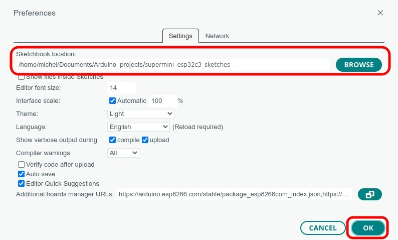

# Additional Libraries

This directory contains additional libraries needed to compile three sketches.

| Directory | Sketch | Library | Version |
| ---       | ---    | --- | --- |
| 03_button_led | button_led.ino  | [mdPushButton](https://github.com/sigmdel/mdPushButton) | 0.1.3 |
| 05_async_web_led | async_web_led | [ESPAsyncWebServer](https://github.com/ESP32Async/ESPAsyncWebServer)  by ESP32Async org.| 3.9.6 |
| 05_async_web_led | async_web_led | [AsyncTCP](https://github.com/ESP32Async/AsyncTCP) by ESP32Async org. | 3.4.10 |
| 06_ble_led | ble_led | [ArduinoBLE](https://github.com/arduino-libraries/ArduinoBLE) by arduino-libraries | 1.5.0 |
 
The period of divergent if not disparate development of the async TCP and web server libraries seems to be coming to an end. The me-no-dev repositories have been archived. It is clearly indicated that the project is now in the hands of the ESP32Async organization. Mathieu Carbou is actively maintaining both of these new repositories. The group's version of the libraries is compatible with the latest pioarduino ESP 32 platform and the most recent esp32 Arduino core. In other words, there is no real need for local copies of these two libraries. They are provided only as a convenience to those wanting to run the sketches in this repository with a minimum of fuss. 

## :warning: Incomplete Libraries

Only essential elements of the three additional libraries are included; all examples and documentation have been removed. 
**Please do not redistribute the content of these directories and always return to the original source when using the libraries in other projects.**

Of course, the incomplete libraries can be replaced by the full libraries. The simplest could be to delete the directories containing the incomplete libraries. Then for each library

- Click on the link to its GitHub repository given above
- Click on the ``[Code]`` button and then on the `Download ZIP` button
- Save the downloaded archive
- Extract the library to a subdirectory of this directory which contains this `README.md` file.

## :warning: Name Conflicts with BLE Libraries

There are name conflicts between the ArduinoBLE library and the BLE libraries in the ESP32-Arduino core. Consequently, the `07_ble_led/ble_led` sketch will not compile in the Arduino IDE because a class is defined in two different libraries. 

```
...
/home/michel/.arduino15/packages/esp32/hardware/esp32/3.3.6/libraries/BLE/src/BLEDescriptor.h:82:7: error: redefinition of 'class BLEDescriptor'
   82 | class BLEDescriptor {
      |       ^~~~~~~~~~~~~
In file included from /home/michel/.../xiao_esp32c3_sketches/libraries/ArduinoBLE/src/BLECharacteristic.h:25,
...
/home/michel/Documents/.../xiao_esp32c3_sketches/libraries/ArduinoBLE/src/BLEDescriptor.h:28:7: note: previous definition of 'class BLEDescriptor'
   28 | class BLEDescriptor {
      |       ^~~~~~~~~~~~~
```

Depending on the order in which sketches were compiled and the state of the cache, the error might only show up when linking is performed.

```
...
collect2: error: ld returned 1 exit status
Multiple libraries were found for "BLEDevice.h"
  Used: /home/michel/Documents/.../xiao_esp32c3_sketches/libraries/ArduinoBLE
  Not used: /home/michel/.arduino15/packages/esp32/hardware/esp32/3.3.6/libraries/BLE
Using library ArduinoBLE at version 1.3.6 in folder: /home/michel/Documents/.../xiao_esp32c3_sketches/libraries/ArduinoBLE 
Using library BLE at version 3.3.6 in folder: /home/michel/.arduino15/packages/esp32/hardware/esp32/3.3.6/libraries/BLE 
exit status 1
```

The solution is to remove the `libraries\ArduinoBLE` subdirectory from the `libraries` directory when compiling `07_ble_led/ble_led` sketch in the Arduino IDE.

# Arduino IDE Configuration

These local libraries will be found and used when compiling the projects only if the sketchbook location is correctly configured in the Arduino IDE.

   1. Go to the Preferences window of the IDE: **File » Preferences**. It would be a good to jot down the previous sketchbook location beforehand in order to restore it when done with the example sketch.
   3. Enter the directory containing the `03_button_led` and `05_async_web_led` directories in  `Sketchbok location:`  
     
   4. Click on the `OK` button.


# pioarduino/PlatformIO IDE Configuration

There is nothing to do here. The `platformion.ini` configuration file contains an entry to the local libraries directory: `lib_dir = ../libraries`. 

# Installing the Full Libraries with the Library Manager

First remove the directory containing this file.

## Arduino IDE

The ESP32Async organization libraries are can be installed with the ArduinoIDE Library Manager (Ctrl+Shift+i or clicking on the library icon which looks like four books on a shelf in the left tool bar). Enter `esp32async` in the search box and click on the **INSTALL** button of the **Async TCP** by ESP32Async and the **ESP Async WebServer** by ESP32Async entries. The ArduinoBLE library can be installed in a similar fashion by searching form `arduinoble`.

## pioarduino IDE

The procedure is very similar in pioarduinoIDE. Go to PIO Home, click on the Libraries icon, and search using `esp32async`. Then click on the 
`AsyncTCP` by ESP32Async and the `ESPAsyncWebServer` by ESP32Async links to install the libraries. Similarly search using `arduinoble` and click on the `ArduinoBLE` by Arduino link to install.

It may be preferable to simply specify the dependency on a project-by-project basis in each project's `platformio.ini` configuration file. The required `lib_deps` values are already in the pertinent configuration file as comments. Remove the leading ';' to enable.

In either case, remove the `lib_dir` entry in the `platformio.ini` file.
